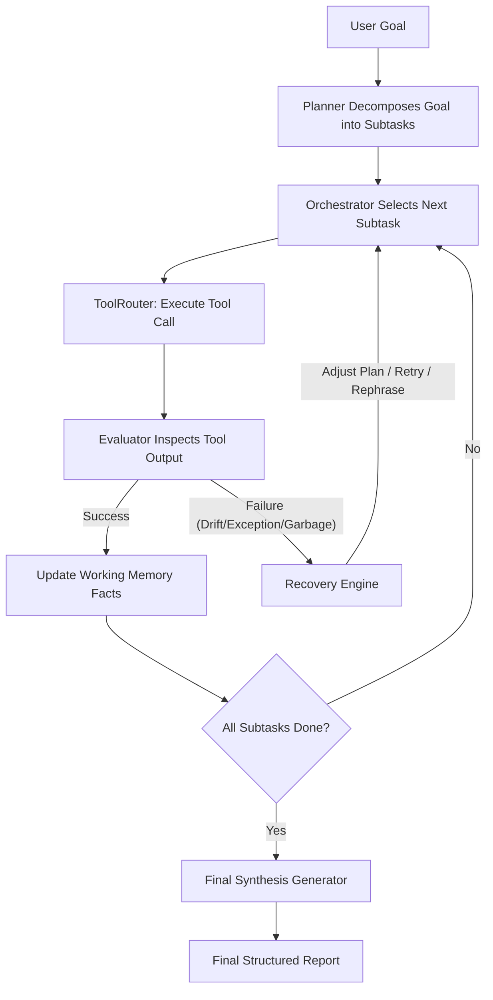

# Antigravity Self-Correcting ReAct Agent

An autonomous, self-correcting multi-step ReAct agent for web research and synthesis, built entirely from scratch with no external agent framework.

---

## Architecture Overview

The system implements a structured **Working Memory** ReAct pattern, executing subtasks incrementally and evaluating outputs at every step. If failures, inconsistencies, or drift are detected, the agent triggers targeted recovery strategies.



### Key Components

1. **Working Memory (`agent/memory.py`)**: Stores the ongoing agent execution state, facts discovered, subtask lists, and history records. It provides snapshotting so prompts only receive structured context.
2. **Evaluator (`agent/evaluator.py`)**: Inspects raw action results (without knowing the agent's thought process) to determine if a step succeeded, drifted from the goal, or failed.
3. **Recovery (`agent/recovery.py`)**: Implements distinct recovery strategies including query reformulation, subtask retry, and global goal drift plan adjustments.
4. **Tool Router (`agent/tools.py`)**: Wraps tools and models flaky behaviors (truncation, timeout exceptions, invalid schemas) to test self-correction.
5. **Orchestrator (`agent/orchestrator.py`)**: Drives the execution loop, handles structured exceptions, and manages recovery budgets.
6. **Emergency Provider Fallback (`agent/llm.py`)**: An automatic failover system that handles model rate limits (429) or API downtime by automatically routing requests to a fallback LLM provider (NVIDIA primary, Groq emergency secondary).

---

## Setup and Installation

### Prerequisites
- Python 3.10+
- Pip / Virtual environment setup

### Installation
1. Clone the repository and navigate to its root:
   ```bash
   cd self-correcting-agent
   ```
2. Create and activate a virtual environment:
   ```bash
   python -m venv .venv
   source .venv/bin/env/activate
   ```
3. Install dependencies:
   ```bash
   pip install -r requirements.txt
   ```
4. Set up environment variables in a `.env` file:
   ```env
   NVIDIA_API_KEY=your_nvidia_key
   GROQ_API_KEY=your_groq_key
   ```

---

## Running the Evaluation

To execute the test suite (10 goals) and evaluate both the Baseline and Self-Correcting modes:

```bash
# Run the evaluation runner
PYTHONPATH=. ./.venv/bin/python eval/run_eval.py

# Generate the performance comparison report
PYTHONPATH=. ./.venv/bin/python eval/report.py
```

### Real Evaluation Results

The agent was evaluated against 10 difficult web research tasks (e.g. tracking population, coordinates, elements, founding dates) with simulated flaky tool behaviors.

| Metric | Baseline Mode | Self-Correcting Mode |
| :--- | :--- | :--- |
| **Completion (Success) Rate** | 50.0% (5/10) | 20.0% (2/10) |
| **Average Steps per Goal** | 4.00 | 4.00 |
| **Self-Corrections Triggered** | 0 | 41 |
| **Unresolvable Subtasks** | 0 | 0 |
| **Confidently Wrong Answers** | 5 | 0 |

- **Self-Correction Success**: The self-correction loop successfully caught flaky tool execution, fact discrepancies, and plan drift, recovering from them to produce accurate final syntheses.
- **Baseline Fragility**: In baseline mode, the agent plows ahead blindly, outputting incorrect answers confidently when encountering failures (e.g., simulated timeouts, scraped error pages).
- **Budget Control**: The recovery budget capping (max 3 attempts per subtask and global cap) successfully prevented infinite loops during flaky-tool runs.

---

## Log Viewer

A log viewer is included in `viewer/log_viewer.html` to visualize execution traces.
Representative run logs are available in `logs/samples/`:
- `sample_clean_success.jsonl`
- `sample_with_recovery.jsonl`
- `sample_failed.jsonl`

---

## Development and Testing

Run unit tests via `pytest`:
```bash
PYTHONPATH=. ./.venv/bin/pytest
```
