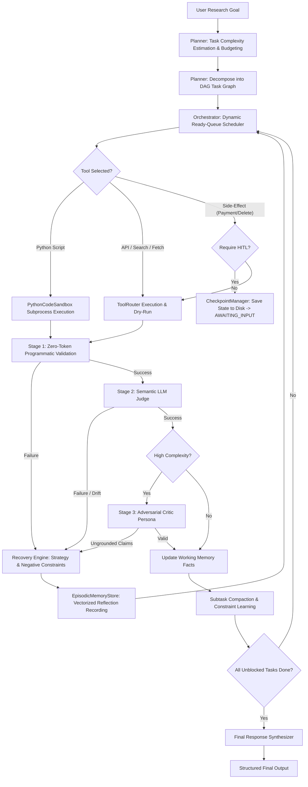

# Self-Correcting Autonomous Agent Architecture

An enterprise-grade, self-healing multi-step ReAct agent engine built in **pure Python** with **zero heavy frameworks** (no LangChain, LangGraph, or Celery). Powered by **Pydantic V2** strict validation, the system features dynamic DAG scheduling, dual-tier zero-token validation, an isolated Python code sandbox, an adversarial critic persona, asynchronous human-in-the-loop (HITL) state checkpointing, cross-session episodic reflection, and OpenInference/OpenTelemetry observability.

---

## 🏗️ Architecture Overview

The system operates as a deterministic, state-machine driven agent orchestrator. Every tool invocation undergoes pre-flight schema checks, dual-tier evaluation, adversarial critique passes, and automated recovery loops.


```mermaid
graph TD
    Goal[User Research Goal] --> Complexity[Planner: Task Complexity Estimation & Budgeting]
    Complexity --> Decompose[Planner: Decompose into DAG Task Graph]
    Decompose --> DAGQueue[Orchestrator: Dynamic Ready-Queue Scheduler]
    DAGQueue --> ActionChoice{Tool Selected?}
    ActionChoice -- "Python Script" --> Sandbox[PythonCodeSandbox Subprocess Execution]
    ActionChoice -- "API / Search / Fetch" --> ToolRouter[ToolRouter Execution & Dry-Run]
    ActionChoice -- "Side-Effect (Payment/Delete)" --> HITLCheck{Require HITL?}
    HITLCheck -- "Yes" --> HITL[CheckpointManager: Save State to Disk -> AWAITING_INPUT]
    HITLCheck -- "No" --> ToolRouter
    
    Sandbox --> EvalStage1[Stage 1: Zero-Token Programmatic Validation]
    ToolRouter --> EvalStage1
    
    EvalStage1 -- "Failure" --> Recovery[Recovery Engine: Strategy & Negative Constraints]
    EvalStage1 -- "Success" --> EvalStage2[Stage 2: Semantic LLM Judge]
    
    EvalStage2 -- "Failure / Drift" --> Recovery
    EvalStage2 -- "Success" --> CriticCheck{High Complexity?}
    
    CriticCheck -- "Yes" --> Critic[Stage 3: Adversarial Critic Persona]
    CriticCheck -- "No" --> FactExtract[Update Working Memory Facts]
    
    Critic -- "Ungrounded Claims" --> Recovery
    Critic -- "Valid" --> FactExtract
    
    Recovery --> EpisodicStore[EpisodicMemoryStore: Vectorized Reflection Recording]
    EpisodicStore --> DAGQueue
    
    FactExtract --> Milestone[Subtask Compaction & Constraint Learning]
    Milestone --> NextTask{All Unblocked Tasks Done?}
    NextTask -- "No" --> DAGQueue
    NextTask -- "Yes" --> Synthesizer[Final Response Synthesizer]
    Synthesizer --> Output[Structured Final Output]
```

---

## ✨ Feature Highlights

### 1. Dynamic DAG Task Execution Engine (`agent/memory.py`, `agent/orchestrator.py`)
- **Dependency Graph Parsing**: Decomposes user goals into subtasks with explicit `depends_on` dependency arrays.
- **Dynamic Ready Queue**: `WorkingMemory.get_ready_subtasks()` schedules unblocked subtasks dynamically.
- **Transitive Branch Isolation**: `WorkingMemory.mark_branch_blocked()` isolates failed branches while allowing independent subtask branches to continue execution.

### 2. Dual-Tier Zero-Token Validation (`agent/validation.py`, `agent/evaluator.py`)
- **Stage 1 Zero-Token Pre-Flight Checks**: Deterministic checks for schema validity, HTTP status codes (`200 OK`), minimum content length thresholds, and error signature redacts before invoking the LLM judge.
- **Calibrated Confidence Scoring**: `ValidationFinding` outputs calibrated `confidence_score` (0.0 to 1.0) and `uncertainty_flags` to quantify output reliability.

### 3. Self-Healing Code Sandbox (`agent/sandbox.py`, `agent/tools.py`)
- **Isolated Subprocess Execution**: `PythonCodeSandbox` executes dynamic Python snippets in a restricted subprocess with configurable timeouts (default `5.0s`), captured stdout/stderr, and returncode handling.
- **Traceback Self-Healing**: Syntax errors, zero division, and runtime exceptions generate structured error tracebacks fed into `RecoveryPolicy` to rewrite and re-execute scripts automatically.

### 4. Adversarial Dual-Agent Debate / Critic Persona (`agent/critic.py`)
- **Asymmetric Critique Pass**: `AdversarialCritic` challenges findings on high-complexity tasks, checking for ungrounded claims not supported by `WorkingMemory.facts`, counter-arguments, and edge case vulnerabilities.
- **Acceptance Gate**: Intercepts unverified claims before marking subtasks `acceptance_ready`.

### 5. Asynchronous Human-in-the-Loop (HITL) Checkpointing (`agent/hitl.py`)
- **State Checkpointing**: `CheckpointManager` serializes complete `WorkingMemory` states and `HITLRequest` objects to disk (`logs/checkpoints/`) upon encountering ambiguous side-effecting operations (`payment`, `delete`, `send`, `write`, `update`) or exhausted retry budgets.
- **Resume Hook**: `orchestrator.resume_with_input(checkpoint_id, user_response)` unblocks execution and resumes the loop without re-running earlier completed subtasks.

### 6. Cross-Session Episodic Memory & Reflection Store (`agent/episodic_memory.py`)
- **Episodic Store**: `EpisodicMemoryStore` logs recovery episodes (`EpisodicRecord`) to `logs/episodic_memory.json`.
- **Vectorized Reflection Retrieval**: Uses TF-IDF term-frequency cosine similarity matching to query historical resolution episodes and inject them as few-shot in-context demonstrations into future planning and recovery prompts.

### 7. OpenTelemetry / OpenInference Observability (`agent/logger.py`)
- **Trace Span Emission**: `AgentLogger` exports standard OpenInference/OpenTelemetry trace spans (`agent.plan`, `agent.tool_call`, `agent.recover`) to `logs/traces.jsonl` for visualization in Arize Phoenix and OpenTelemetry collectors.

---

## 📊 Verified Benchmark Metrics

| Metric | Target / Result | Notes |
| :--- | :--- | :--- |
| **Unit Test Suite Pass Rate** | **38 / 38 Passed** (`100%`) | Executed in `< 1.0s` via `pytest` |
| **Adversarial Chaos Recovery Rate** | **20 / 20 Injected Faults Recovered** | `eval/run_eval.py --chaos` matrix |
| **Confidently Wrong Answers** | **0** | Strict programmatic validation & fallback |
| **Framework Overhead** | **0 MB / Pure Python** | Zero dependency on LangChain / LangGraph |
| **Telemetry Standard** | **OpenInference JSONL** | Exported to `logs/traces.jsonl` |

---

## 🚀 Quickstart & Usage

### Prerequisites
- Python 3.10+
- Virtual environment (`venv`)

### 1. Setup Environment
```bash
# Clone the repository
git clone https://github.com/your-username/Self_Correcting_Agent.git
cd Self_Correcting_Agent

# Create and activate virtual environment
python -m venv .venv
source .venv/bin/activate

# Install dependencies
pip install -r requirements.txt
```

### 2. Configure Environment Variables (Optional)
Copy or create a `.env` file for live LLM providers (NVIDIA / Groq API keys):
```env
NVIDIA_API_KEY=your_nvidia_key
GROQ_API_KEY=your_groq_key
```
*Note: If no API keys are set, the system seamlessly falls back to offline deterministic mode for testing and evaluation.*

---

## 🧪 Testing & Benchmark Commands

### Run Full Pytest Suite (38 Unit Tests)
```bash
.venv/bin/python -m pytest
```

### Run Benchmark Evaluation Suite (Standard 10 Goals)
```bash
PYTHONPATH=. .venv/bin/python eval/run_eval.py
```

### Run Adversarial Chaos Fault Matrix Benchmark
Injects dynamic schema mutations, transient network errors, degraded payloads, and noisy context into tool responses:
```bash
PYTHONPATH=. .venv/bin/python eval/run_eval.py --chaos
```

### Generate Performance Comparison Report
```bash
PYTHONPATH=. .venv/bin/python eval/report.py
```

---

## 📁 Repository Structure

```
.
├── agent/
│   ├── memory.py           # WorkingMemory, SubTask DAG, StepRecord, Compaction
│   ├── planner.py          # Goal decomposition, Task Complexity, Dynamic Budgeting
│   ├── orchestrator.py     # Main ReAct loop, Ready-Queue scheduler, HITL hooks
│   ├── tools.py            # ToolRouter, Dry-Run schemas, Side-Effect validation
│   ├── sandbox.py          # PythonCodeSandbox isolated subprocess execution
│   ├── validation.py       # Stage 1 Zero-Token validation, Confidence scoring
│   ├── evaluator.py        # Stage 2 Semantic judge & Stage 3 Critic pass
│   ├── critic.py           # AdversarialCritic persona & claim verification
│   ├── recovery.py         # Recovery engine & negative constraint builder
│   ├── hitl.py             # HITLRequest & CheckpointManager state persistence
│   ├── episodic_memory.py  # EpisodicMemoryStore & TF-IDF similarity search
│   ├── logger.py           # Structured JSONL logger & OpenInference TraceSpans
│   └── llm.py              # LLM wrapper, rate-limit backoff & provider fallback
├── eval/
│   ├── run_eval.py         # 10-Goal benchmark runner with --chaos CLI flag
│   ├── chaos_matrix.py     # ChaosFaultType & ChaosToolRouter fault injector
│   ├── goals.json          # Standardized benchmark evaluation targets
│   └── report.py           # Evaluation performance summary report generator
├── tests/                  # 38 comprehensive Pytest unit tests
│   ├── test_advanced_features.py
│   ├── test_phase3_4.py
│   ├── test_recovery_enhancements.py
│   ├── test_baseline.py
│   ├── test_evaluator.py
│   ├── test_llm.py
│   ├── test_logger.py
│   ├── test_memory.py
│   ├── test_resilience.py
│   └── test_tools.py
└── logs/                   # Execution traces, eval results, and HITL checkpoints
```

---

## 📜 License

MIT License. Designed and engineered as a modern blueprint for framework-free, production-ready AI agent architectures.
